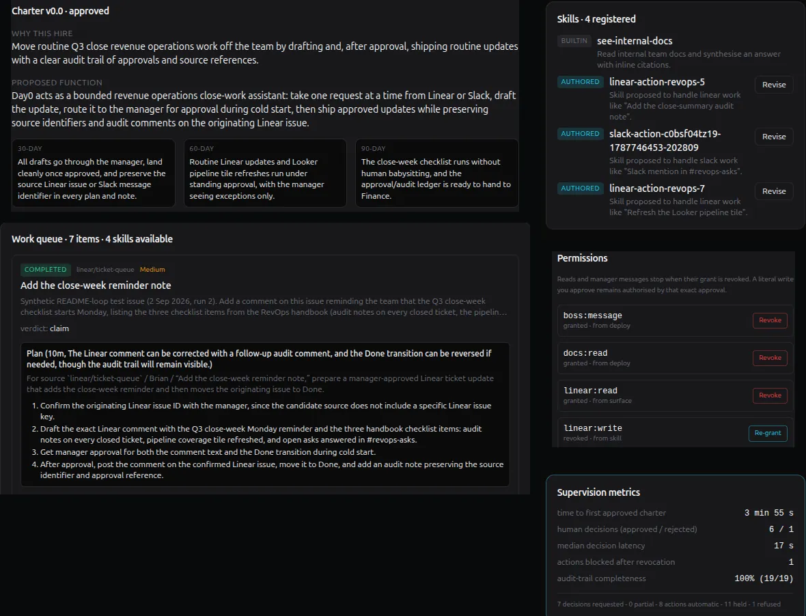
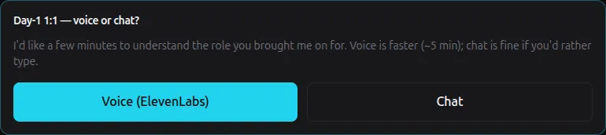
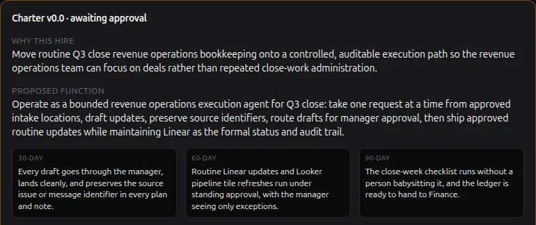
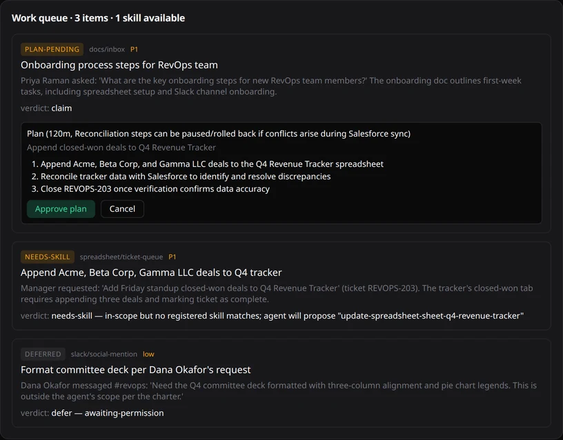

# Day0

An autonomous teammate that joins with no role, no skills and no scope.

[](https://day0-olive.vercel.app) [](#run-it-with-no-accounts) [](LICENSE)

[**Live demo**](https://day0-olive.vercel.app) · [**Run it yourself**](#local-dev), including with no accounts and no hosted model · [**中文说明**](#中文说明) · [**What it is not**](#what-this-is-and-what-it-is-not) · [**How it works**](#runtime-flow)



<p align="center"><i>One agent, seventeen minutes after it was deployed: the charter it wrote from its Day-1 1:1 and had approved, a skill it proposed because none of its registered skills matched the work, and the three items it found for itself. Captured on the account-free local route against <code>qwen3:8b</code> on one consumer GPU.</i></p>

Putting an agent into a real team is an engineering project. Someone defines the role, wires the tools, writes the prompts and encodes what counts as good work, and that work is done again for every team and every organisation that wants one. It is the main reason agents stall at the pilot.

Day0 starts a step earlier. It is deployed empty. Everything it becomes comes out of a conversation with the person who hired it.

## Contents

**Start here** · [What is unusual about it](#what-is-unusual-about-it) · [What this is, and what it is not](#what-this-is-and-what-it-is-not) · [Local dev — three ways to run it](#local-dev)

**Run it** · [No accounts](#run-it-with-no-accounts) · [With an OpenAI key](#run-it-with-an-openai-key) · [On your own systems](#run-it-in-real-mode) · [Convex cloud + Clerk](#convex-cloud--clerk) · [Your own model server](#using-a-model-server-you-already-have)

**Configure it** · [Environment](#environment) · [Ports](#ports-host-side-and-container-side) · [Phones and tunnels](#testing-from-a-phone-and-tunnels) · [ElevenLabs voice](#elevenlabs-agent-setup) · [The local skill sandbox](#the-local-skill-sandbox) · [The GPU](#the-gpu-is-opt-out-not-opt-in)

**How it works** · [Runtime flow](#runtime-flow) · [Stack](#stack) · [Routes](#routes) · [Convex backend](#convex-backend-convex) · [Schema](#schema-convexschemats) · [Domain logic](#domain-logic-src)

**Project** · [Controlled evaluation](evaluation/README.md) · [Evaluation quick start](#evaluation-quick-start) · [Credits](#credits) · [Licence](#licence)

## What is unusual about it

### It is onboarded, not configured

A Day-1 one-to-one, held over voice or chat, walks its new boss through seven topics: why the hire was made, what the role is, who to talk to, what to read, which tools carry the work, what to pick up first, and what is still open. No part of the role is written into a config file.



### It writes its own charter, and waits for a human

From that conversation the agent drafts a charter - its scope, its boundaries, the people it works with, and an explicit list of what it will not do. It holds nothing until a person approves it. On approval the charter becomes its operating scope: an eight-file workspace, five read-scopes, and a set of scoped, revocable capability grants.



### It finds its own work

Nothing hands it a queue. The agent reads its work environment and proposes what to pick up. Each candidate is scored against seven criteria - eligibility, permission, ownership, quality fit, value, risk and capacity - and then moves through an eleven-state lifecycle in which a human approves the plan before anything executes.



### It writes the skill it is missing

A work item that matches no registered skill returns `needs-skill` rather than being dropped. The agent proposes a skill, authors it, then verifies it by running a smoke test in an isolated sandbox. It registers the skill only if the sandbox agrees; one that fails verification, or that was never verified at all, stays visibly uncallable. Capability grows in place, without a developer.

## What this is, and what it is not

Day0 is a working demonstration rather than a product and has no users. Its measured claim is deliberately narrow: the repository ships a [controlled, programmatically graded comparison](evaluation/README.md) of onboarded Day0 versus an ordinary agent on the same 15 unfamiliar mock-office tasks. It does not claim that this benchmark predicts every real team's work.

The agent works inside a self-contained mock office - team docs, a spreadsheet, chat channels, a ticket queue, a social feed - seeded per agent. There are no connectors to real corporate systems, and that is deliberate: the mock environment is what makes a run reproducible on a stranger's laptop instead of a screenshot taken on trust. Everything around it is real - the model calls, the sandbox, the state machine, the approval gates.

The agent core is model-agnostic. `OPENAI_BASE_URL` points the whole layer at any OpenAI-compatible endpoint, so the full loop runs against a model on your own machine with no account anywhere and nothing metered. The sandbox that verifies an authored skill is bundled too, so skill creation finishes on that route rather than stopping one step short of a callable skill. Voice and web research are optional third-party services; without their keys the loop degrades visibly rather than failing silently. [Three ways to run it](#local-dev) are set out below, and `pnpm check:setup` reports which of them the machine you are on is currently set up for.

## Local dev

Three ways to run it. They disagree about two things only: who runs the model, and who holds the accounts.

| Route | Accounts | Setup it costs you | What it gives you |
|---|---|---|---|
| [**No accounts, and you run the model**](#run-it-with-no-accounts) | none | Docker, and one model to pull - `qwen3:8b` is about 5 GB | The whole loop, skill creation included, with nothing signed up for and nothing metered. How fast it answers is a question about your hardware, not about Day0: `pnpm model:up` uses an NVIDIA GPU wherever it finds one |
| [**An OpenAI key, and you run nothing**](#run-it-with-an-openai-key) | OpenAI | Docker, and one key pasted into `.env.local` | The shortest route if you already have a key. No weights to pull and no GPU question - everything but the model still runs on your machine, and you pay OpenAI per token |
| [**The full hosted setup**](#convex-cloud--clerk) | Convex, Clerk, OpenAI | three sign-ups, and a JWT template in the Clerk dashboard | Per-user auth, a backend that is not your laptop, and the exact shape the deployed app runs in - the one to pick if you intend to deploy it |

The first two are the same stack, and differ only in where the model lives: a self-hosted Convex backend in Docker and no-auth dev mode, where one fixed local user owns every row and a request from any other machine is refused by design. The third replaces both halves with hosted ones and gives you a user per Clerk sign-in.

All three need a model: the charter, the plans, the executor and the skill author are all model calls, and nothing in the loop finishes without one. That model does **not** have to be OpenAI. `OPENAI_BASE_URL` points the whole layer at any OpenAI-compatible chat-completions endpoint - keyless local runtimes included - which is what the first route rests on and what lets the other two point anywhere else.

All three also need somewhere to verify an authored skill, and that is bundled as well: `pnpm sandbox:up` starts a local sandbox on any of them, and Daytona is the hosted alternative. Only Exa is genuinely account-only, and its absence costs the good-habits research rather than the loop.

Whichever you pick, `pnpm check:setup` reads `.env.local` and reports each of the five setups - backend, auth, model, sandbox, voice - separately, and fails only on the states that are actually broken rather than merely incomplete.

All three run against the seeded mock office, which is what makes them safe to try. Pointing the same stack at your own documentation and your own systems is one variable and a few components on top of any of them: [Run it in real mode](#run-it-in-real-mode).

## Run it with no accounts

A self-hosted Convex backend in Docker, a local model in Docker, a local verification sandbox in Docker, and no-auth dev mode. Nothing here signs up for anything. The backend is the same open-source binary the cloud service runs; no-auth mode replaces Clerk with one fixed synthetic user, so ownership checks and the per-user data model are unchanged - there is simply only ever one user; the model layer takes any OpenAI-compatible endpoint, so a local runtime is a complete setup rather than a degraded one; and the sandbox is what lets an authored skill actually become callable, which is the half of the headline loop that used to need an account.

You need Docker, Node 22+ and pnpm. Run every command from the repository root.

```bash
pnpm install                     # first: everything below is a repo-local binary
cp .env.example .env.local

pnpm convex:up                   # day0's backend on 3210/3211 (add --profile dev for the dashboard on 6791)
pnpm model:up                    # OpenAI-compatible model server on 11434, on the GPU if you have one
pnpm model:pull qwen3:8b         # ~5 GB, tool-capable, runs the whole loop
pnpm sandbox:up                  # the sandbox that verifies authored skills; no port, no account
pnpm convex:admin-key            # -> paste into CONVEX_SELF_HOSTED_ADMIN_KEY
```

Then set these in `.env.local`:

```bash
NEXT_PUBLIC_DEV_NO_AUTH=true
NEXT_PUBLIC_CONVEX_URL=http://127.0.0.1:3210
CONVEX_SELF_HOSTED_URL=http://127.0.0.1:3210
CONVEX_SELF_HOSTED_ADMIN_KEY=convex-self-hosted|…   # from the command above
OPENAI_BASE_URL=http://127.0.0.1:11434/v1           # what Next dials
CONVEX_OPENAI_BASE_URL=http://model:11434/v1        # what the backend dials
OPENAI_MODEL=qwen3:8b
OLLAMA_CONTEXT_LENGTH=16384                         # model-service input window
# OPENAI_API_KEY stays empty. There is no account.
```

and finish:

```bash
pnpm dev:no-auth-key             # generates the three DEV_NO_AUTH_* values
./scripts/sync-convex-env.sh     # pushes DEV_NO_AUTH_JWKS + model settings to the backend
npx convex dev --once            # push functions
pnpm check:setup                 # confirms all four setups before you open a browser
pnpm dev                         # prints an unlock URL - open that, not localhost:3000
```

Open the unlock URL, deploy an agent, hold the Day-1 1:1 in chat mode, and approve the charter it writes. No provider was called and no account exists.

Approving the charter is what fills the work queue, and how far the queue then gets is decided by the charter you just approved rather than by anything in this file. Each item is evaluated against the skills the agent has and the permissions it was deployed with, and only a `claim` verdict goes on to a plan and an execution. Deploy seeds five read scopes, and the one skill that ships is `see-internal-docs`, so the work that runs immediately is the work that can be answered out of the internal docs. A `needs-skill` verdict is the interesting one and it now finishes on this route: the agent proposes a skill, you approve it, the local sandbox runs its smoke test, and on exit 0 with output the skill registers and the work item that asked for it goes back in the queue and completes. `defer - awaiting-permission` is the verdict that still stops where it stops - it names the scope it wanted and then waits, with nothing in the UI that grants one.

How fast that is has nothing to do with Day0. The agent core makes ordinary OpenAI chat-completions calls, so the wait you get is a property of the endpoint you pointed it at: the same `qwen3:8b` answers in seconds on a current GPU and in minutes on a CPU, and a hosted endpoint answers as fast as the provider does. `pnpm model:up` uses an NVIDIA GPU wherever it finds one, so the fast case is the default rather than something to go looking for.

The bundled server starts with a 16,384-token context because Day0's executor must see the approved charter, discovered documentation, runbook guidance, action schema and work request together. Ollama's smaller server default truncates that prompt from the head without failing the request, which can leave a local model holding the right tool names but not the instructions and evidence that determine their exact arguments. Set `OLLAMA_CONTEXT_LENGTH` higher only when the model supports it and the additional KV cache fits the machine; lowering it below 16,384 is a deliberate quality trade-off, not only a memory optimisation.

Model size shows up in the output as well as on the clock, and the two are worth telling apart before you judge the loop. A small model holds the 1:1, fills the charter and drives the work queue, but it will sometimes decide it has heard enough and call `dayOneComplete` after two topics rather than seven; the charter it writes from that short transcript is a real charter, with thinner evidence in it. A larger model - local or hosted - is the whole of the fix for that, and `pnpm probe:model` tells you whether a given endpoint can drive the loop at all before you wire it into a demo.

**A `failed` work item is the other thing size buys you, and on this route it is an expected outcome rather than a broken one.** An approved plan is executed as a set of named actions against the mock environment, and each one addresses a row by slug - `spreadsheet.appendRow` on a spreadsheet that exists, `ticket.update` on a ticket that exists. A smaller model writes plausible slugs instead of real ones, so some actions land and the invented ones are refused; the item goes to `failed` and the card lists every action that did not reach the environment next to the reason it did not. Nothing is silently half-applied, and the card says so: `Retry` re-runs the *whole* plan, so an action that already landed is applied a second time. Reading that panel is how you tell a small model's invented slug apart from a real fault, and it is the difference between the two runs on the same machine - a hosted model on the same charter dispatches actions against rows that are actually there.

**Slow is not merely slow, though, and this is the failure a local model actually hands you.** Charter synthesis is one Convex action, and it has two ceilings: any single model call inside it gives up after **300 s** without a response header, and the action itself is killed at **600 s**. A model that answers in seconds clears both by a mile. A model that has spilled onto the CPU does not, and what you see then is a 1:1 that ran perfectly and a charter that never arrives - the *same* symptom as the two-addresses mistake below, which is what makes it worth naming here. `npx convex logs` is what tells the two apart: the address mistake fails at once with a connection error, and this one sits there and then reports `UND_ERR_HEADERS_TIMEOUT`, a retry, and `execution timed out (maximum duration 600s)`.

Spilling is a question of free VRAM, not of the model's size on paper, so the fix is a model that fits **what is free on your GPU right now** - which may well mean a smaller one. `docker compose exec model ollama ps` prints the split, and `45%/55% CPU/GPU` on that line is the warning: `qwen3:8b` needs about 6 GB resident, so on a 12 GB card with 7 GB already spoken for it lands half on the CPU, answers a short prompt in ~40 s instead of ~4 s, and never finishes the charter. `qwen3:4b` fits the same gap whole and runs the loop end to end. Pull the smaller one when `ollama ps` says you are splitting:

```bash
pnpm model:pull qwen3:4b         # ~2.5 GB, same loop, fits a smaller gap
```

Six things about that sequence are load-bearing:

- **`pnpm install` comes first.** Every command after it - `tsx`, `convex`, `next` - is a binary in `node_modules`. Skip it and `pnpm dev:no-auth-key` fails with `tsx: not found` and no hint as to why.
- **The model needs two addresses, and this is the one that costs an afternoon.** The Day-1 chat streams from Next, on this machine, and reaches the model on loopback. The *charter* is synthesised by a Convex Node action, which runs inside the backend container, where `127.0.0.1` is the container itself. So `OPENAI_BASE_URL` is what Next dials and `CONVEX_OPENAI_BASE_URL` is what the backend dials; `./scripts/sync-convex-env.sh` pushes the second as the deployment's `OPENAI_BASE_URL` and warns if you left it pointing at loopback. The symptom of getting it wrong is a 1:1 that works perfectly and a charter that never arrives.
- **The key is generated, not chosen.** `pnpm dev:no-auth-key` writes `DEV_NO_AUTH_SECRET` (unlocks a browser), `DEV_NO_AUTH_SIGNING_KEY` (signs the token Convex accepts, never leaves the machine) and `DEV_NO_AUTH_JWKS` (its public half). Rotate with `pnpm dev:no-auth-key --force`, which invalidates every unlocked browser and needs a re-sync.
- **The JWKS must reach the backend before the functions do.** `convex/auth.config.ts` is evaluated against the *deployment's* env when you push, and refuses the push if no-auth is on without a key. `./scripts/sync-convex-env.sh` pushes them in that order and says so if the key is missing. The same ordering matters for the model settings, for a different reason: a module keeps whatever env it was first evaluated with, so a value changed after the backend has run an action needs `pnpm convex:restart`.
- **`pnpm dev` prints an unlock URL.** It carries the secret once; after that it lives in an httpOnly cookie. Open `http://localhost:3000` directly and every route answers 403 - that is the boundary working, not a fault.
- **`pnpm sandbox:up` needs nothing from you and touches nothing else.** The two meet over a socket on a shared volume that the backend container mounts whether or not the sandbox is running, so starting the sandbox later needs no restart and no setting: an empty volume reads as "no local sandbox" until the service fills it, and `pnpm check:setup` says which of the two states you are in.

`pnpm build` refuses while `NEXT_PUBLIC_DEV_NO_AUTH=true` is in the environment. The refusal arrives as the cause of a Next build error - `NEXT_PUBLIC_DEV_NO_AUTH=true is a local-development-only flag and was found in a production-like environment`. Same guard as the mode itself: it only ever resolves under `next dev`, and a flag that reached a Vercel project should fail the build rather than ship an open deployment. Unset it for the build.

### The local skill sandbox

A skill the agent wrote is not a callable skill until something has run it, and that is the step that used to need an account. `pnpm sandbox:up` starts a container that runs the smoke test, so the account-free route finishes the loop it advertises: `needs-skill` → propose → approve → author → **verify** → register → the work item that asked for the skill goes back in the queue and completes.

```bash
pnpm sandbox:up                  # start it; the backend already mounts its socket volume
pnpm sandbox:down                # stop it; skills then stop at `authoring`, visibly
```

**What it is.** An isolation boundary for verification - the same claim this project makes about Daytona, and the same kind of thing:

- **No network at all.** The container runs with `network_mode: none`, which is why the Convex backend reaches it over a unix socket on a shared volume rather than over a port. Model-authored Python in there cannot reach the backend, the model server, your machine or the internet, because there is no interface to reach them through. The authoring prompt already tells the model its smoke test gets a bare Python 3.12 with no third-party packages and must mock external calls, so nothing legitimate wants one.
- **Nothing runs as root.** The service starts as root only long enough to bind its socket, then drops to `nobody` permanently; every smoke test inherits that. All Linux capabilities are dropped bar the two that hand-over needs, and `no-new-privileges` is set.
- **Nothing persists.** The root filesystem is read-only and the working directory is a 64 MB tmpfs, wiped per run, so one smoke test cannot leave anything for the next.
- **Nothing runs long.** 60 seconds of wall clock - the same cap the Daytona path allows - plus CPU, address-space, file-size and process-count limits on the smoke test and memory and pid limits on the container.

**What it is not.** A defence against someone who is trying. A container escape is a container escape; the smoke test shares a user with the small supervisor that launched it, so code that wanted to could stop the service and cost you a restart. It raises the floor for code a model wrote to check its own work. It is not a place to run code you actively distrust, and neither is Daytona in this project's use of it.

**What it deliberately is not built on** is the Docker socket. Mounting `/var/run/docker.sock` into the backend so it could spawn a sandbox per skill is the shortest path to the same feature, and it hands every reader's machine a root-equivalent socket to model-authored code. The service on the compose network is the boundary instead.

Two practical notes:

- **`pnpm sandbox:up` does not restart the backend.** The socket lives on a volume both containers mount, and the backend mounts it from its first `up`, so a sandbox started later is seen at once. Compose reports the backend as `Running` and leaves it alone.
- **Nothing needs configuring.** There is no port and no address to keep in step - the one place a local model costs you an afternoon on this stack. `SKILL_SANDBOX_SOCKET` exists for a Convex backend running somewhere other than the bundled container, which is also the case it does not cover: an [anonymous deployment](#without-docker-for-convex) runs as an ordinary process on this machine and cannot see inside a Docker volume, so use the compose backend if you want local skill verification.

With both a `DAYTONA_API_KEY` and a running local sandbox, **Daytona wins**: an API key in the environment is a deliberate act, and the local sandbox is there to be the answer when there is no key. Clear the key to use the local one.

### The GPU is opt-out, not opt-in

`pnpm model:up` looks for an NVIDIA driver on the host and, finding one, layers `docker-compose.gpu.yml` over the compose file so the container reserves the GPU. It prints the device the container ended up with. Where Docker declines to hand one over - no container toolkit, usually - it says why and starts the same service on the CPU, because a model server that is slow beats one that will not start.

That fallback is why the reservation is a second file rather than a block in `docker-compose.yml`: an unsatisfiable device request is fatal rather than ignored, and the container is created and then refuses to start with `could not select device driver "nvidia" with capabilities: [[gpu]]`. `docker compose --profile model up -d model` with the base file alone is the CPU configuration, and every machine can run it.

Pin the decision in `.env.local` when the guess is wrong:

| | |
|---|---|
| `MODEL_GPU=auto` | the default - use a GPU where the driver is there, fall back where Docker refuses |
| `MODEL_GPU=on` | require one, and fail loudly rather than run slowly |
| `MODEL_GPU=off` | never ask for a device |
| `MODEL_GPU_COUNT=1` | reserve one device instead of all of them |
| `OLLAMA_CONTEXT_LENGTH=16384` | keep the charter, documentation, runbook and executor schema in one local-model prompt |

A model larger than your free VRAM is loaded partly on the CPU whatever was reserved. `docker compose exec model ollama ps` prints the split, and is the thing to check when an accelerated setup is still mysteriously slow.

Every `:up` has a matching `:down`, and `pnpm convex:down` really does mean only Convex - the model service is behind a compose profile and outlives it, holding several gigabytes resident, which is not what you want after you thought you had stopped:

```bash
pnpm model:down                  # the model server; the pulled weights stay
pnpm sandbox:down                # the verification sandbox; it holds nothing
pnpm convex:down                 # the backend; the data volume stays
```

In that order: `convex:down` removes the compose network on its way out, and cannot while the model container is still attached to it. The sandbox is on no network at all, so it is only in that list to be tidy - it is a few megabytes of idle Python.

To throw the volumes away too, all together: `pnpm convex:down --profile model --profile sandbox -- -v`.

Every service in `docker-compose.yml` sits behind a profile, and the profiles are the components: `real` is day0's backend and is added to every `pnpm convex:*` command for you, and each other profile adds one optional component. `pnpm convex:up --help` lists them; what each one is for, when you need it and what it never sees is in `docs/running/components.md`.

### Without Docker for Convex

`pnpm convex:dev` with nobody logged in does not stop to ask for an account: it creates an **anonymous deployment**, a backend the Convex CLI runs on this machine, and prints `Run npx convex login at any time to create an account and link this deployment`. That is a second account-free route to a backend, and a shorter one - no compose project, no admin key, and no second model address, because a backend running as an ordinary process on this machine reaches `127.0.0.1` the same way Next does:

```bash
pnpm install
cp .env.example .env.local
# NEXT_PUBLIC_DEV_NO_AUTH=true, OPENAI_BASE_URL=http://127.0.0.1:11434/v1, OPENAI_MODEL=qwen3:8b
pnpm convex:dev                  # anonymous local deployment; writes the Convex keys itself
pnpm dev:no-auth-key
./scripts/sync-convex-env.sh
pnpm dev
```

You still need a model - a native `ollama serve` on 11434, or `pnpm model:up` and `MODEL_PORT` for the bundled one. What you give up against the self-hosted stack is a deployment you own and can keep: the compose backend has its own volume, its own dashboard, and survives independently of the CLI. Use this route to see the thing run; use the one above to keep working on it.

## Run it with an OpenAI key

Everything the route above runs, minus the model. The same self-hosted Convex backend in Docker and the same no-auth dev mode - so still no Convex account, no Clerk, and one fixed local user - with `api.openai.com` in place of a model server you host. If you already have a key, this is the shortest way to see the loop run: nothing to pull, nothing left resident afterwards, and the pauses between steps are a hosted model's rather than your laptop's.

```bash
pnpm install
cp .env.example .env.local

pnpm convex:up                   # day0's backend on 3210/3211 (add --profile dev for the dashboard on 6791)
pnpm sandbox:up                  # verifies authored skills; no account, no key
pnpm convex:admin-key            # -> paste into CONVEX_SELF_HOSTED_ADMIN_KEY
```

Then set these in `.env.local`:

```bash
NEXT_PUBLIC_DEV_NO_AUTH=true
NEXT_PUBLIC_CONVEX_URL=http://127.0.0.1:3210
CONVEX_SELF_HOSTED_URL=http://127.0.0.1:3210
CONVEX_SELF_HOSTED_ADMIN_KEY=convex-self-hosted|…   # from the command above
OPENAI_API_KEY=sk-…
OPENAI_MODEL=gpt-5.5
# OPENAI_BASE_URL and CONVEX_OPENAI_BASE_URL both stay empty - see below.
```

and finish exactly as the account-free route does:

```bash
pnpm dev:no-auth-key             # generates the three DEV_NO_AUTH_* values
./scripts/sync-convex-env.sh     # pushes DEV_NO_AUTH_JWKS + the key to the backend
npx convex dev --once            # push functions
pnpm check:setup
pnpm dev                         # prints an unlock URL - open that, not localhost:3000
```

**The two addresses collapse into one here, which is the point.** Empty means `https://api.openai.com/v1`, and that address means the same thing from Next as it does from inside the backend container - so the trap that costs an afternoon on a local model server cannot be sprung. Next reaches it over this machine's ordinary outbound connection and the backend over its container's, and the charter arrives from the Node action just as the chat streams from Next. Leave both variables empty rather than writing the default into them; there is nothing to point anywhere.

Two things to know:

- **Coming from the local-model route, clear `OPENAI_BASE_URL` and `CONVEX_OPENAI_BASE_URL` and re-sync.** `./scripts/sync-convex-env.sh` clears the deployment's copy when both are empty, which is the one case where "unset" is a value rather than an omission: a deployment still holding `http://model:11434/v1` would call a model server you have since stopped, and only the actions would fail. Restart the backend afterwards - `pnpm convex:restart` - because a module keeps whatever env it was first evaluated with.
- **This route meters.** The loop is a lot of model calls: seven topics of 1:1, charter synthesis, good-habits research, an evaluation and a plan per work item, and a full authoring pass per skill. On `gpt-5.5` a demo run is cents rather than dollars, but it is not zero, which the account-free route is.

No `pnpm model:up` here, so `pnpm sandbox:down && pnpm convex:down` is the whole teardown. And combined with the [anonymous deployment](#without-docker-for-convex) above, this route needs no Docker either: a key, `pnpm convex:dev`, and nothing else running on your machine - at the cost of the local sandbox, which lives in Docker, so skill verification on that combination means a `DAYTONA_API_KEY`.

## Run it in real mode

Everything above runs day0 against a **seeded mock office**: the systems, the tickets and the messages are fixtures, and nothing the agent does leaves your machine. Real mode is the other setting of one variable. Day0 then reads the documentation you point it at, proposes a connection to each system that documentation records, and - once you approve a card - acts on those systems for real: a comment on your ticket, a message in your channel, a form filled in on a web UI it drives through a browser.

It is deliberately restricted to local no-auth development. `DAY0_SURFACE_MODE=real` throws unless `NEXT_PUBLIC_DEV_NO_AUTH=true`, `NODE_ENV=development` and nothing names Vercel, so the mode that can touch live systems cannot be reached on a hosted deployment at all (`src/lib/surface-mode.ts`).

### The components you need

Real mode adds optional components, and each one is a Compose profile. `real` is day0 itself and is added for you; you name the rest:

| Profile | Component | You need it when |
|---|---|---|
| `docs-notion` | Notion's own MCP server, run inside your network | your documentation is in Notion. A folder, a git repository or a list of URLs needs no component |
| `browser` | Playwright MCP, day0's browser floor | a system your documentation records has a web UI and no API |
| `demo` | a synthetic Looker-style pipeline tile with a login | you want a web-UI-only system to drive without pointing day0 at a real one |
| `sandbox` | the networkless skill sandbox | always, unless you have a `DAYTONA_API_KEY` |

What each is for, and what it never sees, is in [`docs/running/components.md`](docs/running/components.md).

### Setup

The route is the [OpenAI-key one](#run-it-with-an-openai-key) plus a documentation folder, the real-mode variables and the components. Two things about the order are load-bearing and neither is obvious, so the sequence below is the whole of it:

```bash
pnpm install
cp .env.example .env.local
pnpm dev:no-auth-key             # BEFORE the first `up`: see below
```

Then set these in `.env.local`, on top of what `pnpm dev:no-auth-key` just wrote:

```bash
COMPOSE_PROJECT_NAME=day0                           # whatever you set, `check:setup` reads the same file
NEXT_PUBLIC_DEV_NO_AUTH=true
NEXT_PUBLIC_CONVEX_URL=http://127.0.0.1:3210
CONVEX_SELF_HOSTED_URL=http://127.0.0.1:3210
OPENAI_API_KEY=sk-…
OPENAI_MODEL=gpt-5.5

DAY0_SURFACE_MODE=real
DAY0_DOCS_HOST_DIR=./docs-local                     # your runbooks; created empty if missing
DAY0_BROWSER_MCP_URL=http://playwright-mcp:8931/mcp # paired with --profile browser
```

and bring the stack up:

```bash
pnpm convex:up --profile docs-notion --profile browser --profile demo
pnpm sandbox:up                  # verifies authored skills; no port, no account
pnpm convex:admin-key            # -> paste into CONVEX_SELF_HOSTED_ADMIN_KEY in .env.local

pnpm sync:env                    # pushes the no-auth JWKS, the key and every DAY0_* value
npx convex dev --once            # push functions
pnpm convex:restart              # the backend keeps the env its modules were first evaluated with
pnpm check:setup                 # every component, every setup, before you open a browser
pnpm dev                         # prints an unlock URL - open that, not localhost:3000
```

Four things in that sequence are the ones that cost you an afternoon:

- **`pnpm dev:no-auth-key` comes before the first `pnpm convex:up`, not after it.** It writes two real-mode values as well as the three no-auth ones: `DAY0_CREDENTIAL_KEY`, which encrypts every stored credential and which `pnpm sync:env` refuses real mode without, and `DAY0_NOTION_MCP_AUTH_TOKEN`, which authenticates the private hop to the Notion component. `--profile docs-notion` exits immediately without the second - `DAY0_NOTION_MCP_AUTH_TOKEN is required by --profile docs-notion` - so on the account-free and OpenAI-key routes above the order is a preference and here it is a requirement.
- **The admin key belongs to the volume, not to the project.** `pnpm convex:admin-key` generates it inside the backend container, and a backend on a fresh data volume issues a fresh key. Coming to real mode from an earlier stack, the key already in `.env.local` is the *old* backend's: `pnpm sync:env` then fails to authenticate against the new one. Regenerate it whenever the volume is new.
- **Push the env before the functions, and restart after.** `convex/auth.config.ts` is evaluated against the deployment's env at push time and refuses a no-auth push with no key, so `pnpm sync:env` has to be first. A module then keeps whatever env it was first evaluated with, and the backend has been up since the first `up`, so `pnpm convex:restart` after the push is what makes it read the values you just pushed. One push is enough; nothing needs pushing twice.
- **`pnpm check:setup` guesses the Compose project.** It looks for one called `day0` unless `COMPOSE_PROJECT_NAME` says otherwise, and Compose names the project after your directory. In a clone called anything else, an unset name is a checker that reports every component as absent while `docker ps` shows them running. Set it in `.env.local`; both read that file. And read the whole output rather than the summary lines - the component notes underneath them are where the real gaps are.

### The documentation is yours

Nothing in this repository is your team's documentation, and `docs-local/` is not in it - `pnpm convex:up` creates the directory empty so the read-only mount has something to bind. Real mode is worth nothing until you put something there: the runbooks, onboarding page and systems list your team actually uses, in Markdown. Day0 reads that folder read-only, redacts credential values out of what it stores, and treats the systems it names as the systems that exist.

Then, in the browser:

1. **Link documentation first**, on the documentation page, before you deploy: the deploy form lists the linked sources and the agent reads only the ones ticked. A folder source takes a path *relative to the mount* - `.` is the whole of `DAY0_DOCS_HOST_DIR`. A Notion source takes the component's locator, `http://docs-notion-mcp:3000/mcp`, and your own Notion integration token in the secret field; the token is passed through to Notion and never stored in the clear. Each source shows `synced` and a page count when it has been read.
2. **Deploy an agent**, then **hold the Day-1 1:1** and approve the charter it writes. Voice needs ElevenLabs; chat needs nothing and runs the identical seven topics. The agent will ask about tools and reading that the documentation already answers - answer anyway; the charter records what you said.
3. **Approve the connection cards** on the Surfaces tab. Orientation proposes one card per system the documentation and the charter name, each with the evidence it was proposed from and the credential it found, and each needs *both* the manager and IT approval buttons - in a single-user run that is you twice. A Slack card with no `DAY0_PUBLIC_URL` offers a field to land a shared bot token instead of provisioning an app; paste the token there *before* approving, because the probe runs the moment the second approval lands. A system with no approved path stays `absent`, and work that needs it defers at the connection gate instead of guessing.
4. **Decide the work.** Skills the agent proposes, plans and held actions arrive in the dashboard and, once Slack is connected, in your DM as a short code - `approve <code>` or `reject <code> <reason>` from the manager's own Slack account, which is the only author the poller accepts. A held action can be approved, or the whole run rejected with a reason; rejecting stops the run, and a retry after anything landed first asks you to confirm the provider state. Turning autonomous actions on (the header switch, with a confirmation) raises the work-in-progress cap and lets in-policy writes apply without a code. Revoking a read or the DM grant stops queued and in-flight work that needs it and records the block; a write you approved literally stays authorised by that approval, and under the switch a write is authorised by the switch itself.
5. **Read the ledger.** The Supervision card counts what you approved, rejected and revoked. The same trail as JSON is one query, and because every per-agent query checks the caller, the CLI has to present the local owner's identity to run it:

   ```bash
   npx convex run events:exportForAgent '{"agentId":"<id>"}' --identity '{"subject":"dev-no-auth|local-boss"}'
   ```

   Without `--identity` the call is refused as not authenticated - that is the no-auth boundary, not a broken export. The agent id is the last segment of the dashboard URL.

### Teardown

```bash
pnpm sandbox:down
pnpm convex:down --profile docs-notion --profile browser --profile demo
```

`pnpm convex:down` removes the network on its way out and cannot while a container is still attached to it, so name the same profiles you brought up. The data volume survives both, which is what lets you stop for the day and come back to the same agent; `pnpm convex:down -- -v` is the one that throws it away.

## Convex cloud + Clerk

```bash
pnpm install
pnpm convex:dev                  # one-off: provisions deployment, writes .env.local Convex keys
./scripts/sync-convex-env.sh     # push provider keys into Convex deployment env
pnpm dev                         # http://localhost:3000
```

Both accounts are free to create and neither step can be done for you:

- **Convex** — `pnpm convex:dev` offers a choice on first run: log in, which opens a browser to sign up at [convex.dev](https://convex.dev) and then asks you to name a project, or carry on without an account, which gives you a local [anonymous deployment](#without-docker-for-convex) instead. This route is the cloud one, so log in - it is the account. Either way the command writes `CONVEX_DEPLOYMENT` and `NEXT_PUBLIC_CONVEX_URL` into `.env.local` itself. With no terminal to prompt at, it takes the anonymous option silently, which is worth knowing before you wonder why nothing appeared on the dashboard.
- **Clerk** — create an application at [dashboard.clerk.com](https://dashboard.clerk.com), copy the publishable and secret keys into `.env.local`, then add a JWT template named exactly `convex` (JWT Templates → New template). Copy its Issuer URL, with no trailing slash, into `CLERK_JWT_ISSUER_DOMAIN` and re-run `./scripts/sync-convex-env.sh` so the deployment sees it too. Without that template Convex cannot verify a Clerk token and every signed-in call is refused.

`pnpm dev` binds `localhost`, which is also the host Clerk's proxy rewrites to; a `127.0.0.1` bind reads as a foreign origin to Next 16 and breaks the sign-in handshake.

Before either account exists the app still starts, which is worth knowing so you do not mistake it for a broken checkout: `pnpm dev` serves the landing page normally, and every route that would spend a provider key answers `401 {"error":"not authenticated"}`. Nothing is wrong - there is simply no one signed in and no way to become someone. `pnpm check:setup` says the same thing without starting a server.

## Using a model server you already have

The bundled `model` service is a convenience, not a dependency - skip `pnpm model:up` and point the two variables at anything that speaks OpenAI chat completions (ollama, llama.cpp, LM Studio, vLLM, Groq, Together). The only rule is the one above: the second address must resolve *inside* the backend container.

| Where the endpoint runs | `OPENAI_BASE_URL` (Next) | `CONVEX_OPENAI_BASE_URL` (backend) |
|---|---|---|
| The bundled `model` service | `http://127.0.0.1:11434/v1` | `http://model:11434/v1` |
| On this host, bound to all interfaces | `http://127.0.0.1:11434/v1` | `http://host.docker.internal:11434/v1` |
| A remote or hosted endpoint | the same URL | leave empty |

`host.docker.internal` is mapped for you in `docker-compose.yml`, but whether traffic from the container actually reaches your host is a firewall question and some machines drop it. If in doubt, use the bundled service: a compose network is not something a host firewall sits in the middle of.

```bash
pnpm probe:model
```

answers whether a given endpoint can drive the loop - chat completions, JSON extraction, native `response_format`, prompt-injected schema, and the `auto` ladder the app actually runs on. A rung the server declines is reported as a note rather than a failure, because plenty of compatible servers refuse `response_format` and run the whole loop on prompt injection. It calls only the endpoint in `.env.local`.

## Environment

Copy `.env.example` to `.env.local` and fill in:

| Variable | Purpose |
|---|---|
| `NEXT_PUBLIC_CONVEX_URL`, `CONVEX_DEPLOYMENT` | Set by `pnpm convex:dev` on first run |
| `NEXT_PUBLIC_CLERK_PUBLISHABLE_KEY`, `CLERK_SECRET_KEY` | Clerk dashboard keys |
| `CLERK_JWT_ISSUER_DOMAIN` | Issuer URL of the Clerk JWT template named `convex` (also push to Convex env) |
| `OPENAI_API_KEY`, `OPENAI_MODEL` | The model. Default model `gpt-5.5` on OpenAI. A key is needed only when you use OpenAI |
| `OPENAI_BASE_URL` | Any OpenAI-compatible chat-completions endpoint, which is what makes the account-free path work. Unset means `https://api.openai.com/v1`. This is the address **Next** dials |
| `CONVEX_OPENAI_BASE_URL` | The same endpoint as the **Convex deployment** must dial it, when that differs. It does with a self-hosted backend, whose Node actions run inside a container. Empty pushes `OPENAI_BASE_URL` unchanged |
| `OPENAI_JSON_MODE` | `auto` (default), `native` or `prompt`. `auto` starts on `response_format` and falls back to prompt injection only when dropping the parameter is what fixed it |
| `ELEVENLABS_API_KEY`, `ELEVENLABS_AGENT_ID` | ElevenLabs Conversational AI. Optional - without them the mode picker greys voice out and chat runs the identical 1:1 |
| `ELEVENLABS_WEBHOOK_SECRET` | Signs the post-call webhook. A **separate** setup from the two above: without it voice still connects and only post-call finalisation is refused. See [Voice](#elevenlabs-agent-setup) |
| `EXA_API_KEY` | Good-habits research |
| `DAYTONA_API_KEY`, `DAYTONA_API_URL` | The hosted skill-verification sandbox. Optional: without a key the [bundled local sandbox](#the-local-skill-sandbox) does the same job, and with neither an authored skill stops at `authoring` and stays uncallable |
| `SKILL_SANDBOX_SOCKET`, `SKILL_SANDBOX_TIMEOUT_SECONDS` | The local sandbox. Both have working defaults and the bundled stack needs neither. See [The local skill sandbox](#the-local-skill-sandbox) |
| `CONVEX_SELF_HOSTED_URL`, `CONVEX_SELF_HOSTED_ADMIN_KEY` | Self-hosted backend instead of Convex cloud. Set by the steps in [Run it with no accounts](#run-it-with-no-accounts) |
| `CONVEX_BIND_ADDR`, `CONVEX_PORT`, `CONVEX_SITE_PROXY_PORT`, `CONVEX_DASHBOARD_PORT`, `MODEL_PORT` | Host side of the self-hosted stack. See [Ports](#ports-host-side-and-container-side) |
| `MODEL_GPU`, `MODEL_GPU_COUNT` | Whether the bundled model service reserves a GPU. `auto` (default) uses one where there is one. See [The GPU is opt-out, not opt-in](#the-gpu-is-opt-out-not-opt-in) |
| `NEXT_PUBLIC_DEV_NO_AUTH`, `DEV_NO_AUTH_SECRET`, `DEV_NO_AUTH_SIGNING_KEY`, `DEV_NO_AUTH_JWKS` | No-auth dev mode. The last three are written by `pnpm dev:no-auth-key`, never by hand |
| `COMPOSE_PROJECT_NAME` | The Compose project the stack runs as. Unset, Compose names it after the directory you cloned into and `pnpm check:setup` looks for one called `day0` - so set it whenever the directory is not `day0`. See [Ports](#ports-host-side-and-container-side) |
| `DAY0_SURFACE_MODE` | `mock` (default) drives the seeded mock office; `real` lets the agent act on your own systems through the connections your documentation records. See [Run it in real mode](#run-it-in-real-mode) |
| `DAY0_DOCS_HOST_DIR`, `DAY0_DOCS_ROOT` | The documentation folder, mounted read-only into the backend. The host path is Compose's (`./docs-local` by default, created empty for you); `/docs` is what Convex actions see. Real mode only |
| `DAY0_CREDENTIAL_KEY` | Encrypts every stored credential. Written by `pnpm dev:no-auth-key` and pushed to the deployment; `pnpm sync:env` refuses real mode without it |
| `DAY0_NOTION_MCP_AUTH_TOKEN` | Authenticates the private hop to the bundled Notion component. Written by `pnpm dev:no-auth-key`; `--profile docs-notion` refuses to start without it |
| `DAY0_BROWSER_MCP_URL` | The switch that tells day0 it has a browser component. `http://playwright-mcp:8931/mcp` for the bundled one, paired with `--profile browser`. Unset means this deployment has no browser, and every browser action is refused with `BROWSER_DRIVER_ABSENT` |
| `DAY0_PUBLIC_URL` | The https origin a provider redirects a finished OAuth install back to. Needed only to provision a dedicated Slack app; unset, Slack is connected with a shared bot token instead |

Convex Node actions read their settings from the Convex deployment env, which is a separate store from `.env.local`: the model keys (`OPENAI_API_KEY`, `OPENAI_BASE_URL`, `OPENAI_MODEL`, `OPENAI_JSON_MODE`), `EXA_API_KEY`, `DAYTONA_API_KEY`, `SKILL_SANDBOX_SOCKET` and every real-mode `DAY0_*` value bar `DAY0_DOCS_HOST_DIR`, which is Compose's alone. `./scripts/sync-convex-env.sh` pushes exactly that list and is the only thing that should write it; it also pushes `OPENAI_BASE_URL` under the deployment's name for it, taking the value from `CONVEX_OPENAI_BASE_URL`. ElevenLabs and Clerk keys stay local - only Next.js reads those.

**Deployment env is read once, when a function module is first evaluated.** A backend that has already run an action keeps the values it started with, so changing them afterwards leaves `npx convex env list` reporting the new value while the running action still uses the old one. Push the env *before* the first function push, and if you change it later restart the backend: `pnpm convex:restart` self-hosted, or `npx convex deploy` on cloud.

## Ports (host side and container side)

`CONVEX_PORT`, `CONVEX_SITE_PROXY_PORT`, `CONVEX_DASHBOARD_PORT` and `MODEL_PORT` move the **host** ports. The containers always listen on 3210, 3211, 6791 and 11434, and the backend's own view of itself (`CONVEX_CLOUD_ORIGIN`, which Node actions dial to reach the backend they run in) stays canonical whatever the host publishes. Set the ports, not the origins:

```bash
# .env.local
CONVEX_PORT=3320
CONVEX_SITE_PROXY_PORT=3321
CONVEX_DASHBOARD_PORT=6891
MODEL_PORT=11534
NEXT_PUBLIC_CONVEX_URL=http://127.0.0.1:3320
CONVEX_SELF_HOSTED_URL=http://127.0.0.1:3320
OPENAI_BASE_URL=http://127.0.0.1:11534/v1
```

`CONVEX_OPENAI_BASE_URL` does **not** follow `MODEL_PORT`: the backend reaches the model container over the compose network, where it is still `http://model:11434/v1`. Same rule as the origins - host ports move, container ports do not.

The [sandbox](#the-local-skill-sandbox) has no entry here because it has no port. It is reached over a unix socket on a shared volume, so it cannot collide with anything and nothing about it needs moving to run a second stack.

**Set these before the first `:up`, which is earlier than the walkthroughs above put you in this file.** `pnpm convex:up` and `pnpm model:up` pass `.env.local` to docker compose, so a port only moves for containers created after it changed. Both routes above tell you to edit `.env.local` *after* bringing the backend up, which is the right order while the defaults are free and the wrong one as soon as they are not - so if you know you need a port, copy `.env.example` and set it first. Changing one afterwards is not fatal, only unobvious: `pnpm model:up` recreates the model container on the new port, and `pnpm convex:down && pnpm convex:up` is what moves the backend.

`MODEL_PORT` defaults to 11434, which is also the port a native `ollama serve` takes, so the one machine most likely to collide is the one that already has ollama on it. `pnpm model:up` reports it plainly - `Bind for 127.0.0.1:11434 failed: port is already allocated` - and the fix is either `MODEL_PORT` and a matching `OPENAI_BASE_URL`, or skipping the bundled service and [pointing at the server you already have](#using-a-model-server-you-already-have).

**The optional components take no host port at all.** The Notion component (3000), the Looker tile (8080) and the browser component (8931) are reachable only from inside the Compose network, which is where day0 reaches them from, so nothing about them can collide with anything on your machine and none of them has a variable here. The one exception is the Slack provider double behind `--profile test`, which publishes `FAKE_SLACK_HOST_PORT` (8090) precisely so a browser on this host can follow its synthetic install link.

**The Compose project is named after the directory you cloned into, and one command disagrees.** Nothing in this repository passes `-p`: `pnpm convex:up` runs `docker compose --env-file .env.local`, so Compose falls back to the lower-cased directory name - `day0` for a clone in `day0/`, `day0-review` for one in `day0-review/`. `pnpm check:setup` is the one command that has to guess it, and it guesses `day0`. The symptom of a differently-named directory is a `check:setup` that reports every component as not running while `docker ps` shows them all up. Set the name once in `.env.local` and both sides agree, because Compose reads it from the env file just as the checker does:

```bash
# .env.local
COMPOSE_PROJECT_NAME=day0
```

That is also how you run two stacks side by side - a second project name, a second set of host ports, and volumes that stay separate:

```bash
# .env.local for the second stack
COMPOSE_PROJECT_NAME=day0-review
CONVEX_PORT=3320
CONVEX_SITE_PROXY_PORT=3321
```

`pnpm convex:down` removes only the project it is run from, and `--` passes flags through to Compose, so `pnpm convex:down -- -v` is the one that also throws that project's data volume away.

Override `CONVEX_CLOUD_ORIGIN` or `CONVEX_SITE_ORIGIN` only with an address that resolves *inside* the container. An address only your browser can resolve belongs in `NEXT_PUBLIC_CONVEX_URL` (the app) or `CONVEX_BROWSER_ORIGIN` (the Convex dashboard container) instead.

## Testing from a phone, and tunnels

`pnpm dev` binds `localhost`, so nothing off this machine reaches it until you widen that - and widening the Next bind alone is never enough, because the browser also talks to Convex directly. (`localhost` rather than `127.0.0.1` because that is the host Clerk's proxy rewrites to, and Next 16 treats a `127.0.0.1` bind as a foreign origin.)

| What you want | Works? | What it takes |
|---|---|---|
| Laptop browser, no accounts | yes | the sequence above, everything on loopback |
| ElevenLabs post-call webhook against local dev | yes, in either mode | `cloudflared tunnel --url http://localhost:3000`, and the tunnel URL as the agent's post-call webhook. The webhook route is exempt from the no-auth gate and authenticates itself by HMAC |
| Phone on your LAN, no-auth mode | **no** | deliberately incompatible: no-auth refuses any request whose `Host` is not loopback, on top of the key check. Use Clerk for phone testing |
| Phone on your LAN, Clerk mode | yes | `next dev -H 0.0.0.0`; `CONVEX_BIND_ADDR=0.0.0.0`; `NEXT_PUBLIC_CONVEX_URL=http://<laptop-lan-ip>:3210`; `CONVEX_BROWSER_ORIGIN` to match if you want the Convex dashboard usable from the phone too |
| Phone anywhere, Clerk mode, public tunnel | yes | tunnel Next as above, and use a **Convex cloud** deployment. A tunnel to `:3000` does not carry the browser's Convex traffic, and exposing a self-hosted backend publicly hands out an unauthenticated database |

Widening `CONVEX_BIND_ADDR` publishes a backend with no authentication of its own to your network. It is not what holds no-auth mode shut - that is the local key - but it is still a database on a LAN port, so put it back to `127.0.0.1` afterwards.

## ElevenLabs agent setup

The voice mode uses an ElevenLabs Conversational AI agent configured in the ElevenLabs dashboard. Its system prompt must walk the boss through the same seven topics as `app/api/voice/chat/route.ts` so both modes produce a charter of the same shape after `synthesiseFromTranscript`. Recommended dashboard config:

- **First message:** `Hi — I'm Day0, the agent you just deployed. I'd love a few minutes to understand the role you've brought me on for. Ready when you are.`
- **Voice:** any natural English voice.
- **Dynamic variables:** declare all three of `internal_agent_id`, `internal_session_token` and `boss_label` on the agent. The browser sends them in `startSession({ dynamicVariables })` and the post-call webhook reads the first two back - `internal_session_token` is the per-session token `voice.start` mints, and it is what proves a delivered transcript belongs to that call. An agent that does not declare it cannot round-trip it.
- **Post-call webhook:** ElevenLabs dashboard → **Developers → Webhooks → Create webhook**, pointed at `https://<your-host>/api/voice/elevenlabs/webhook` (the deployed Vercel URL, or a Cloudflare quick-tunnel for local dev). Copy the shared secret it shows **once** at creation into `ELEVENLABS_WEBHOOK_SECRET`. Then enable it for this agent on [the agents settings page](https://elevenlabs.io/app/agents/settings).
- **Security:** if the agent is private, the API key used by `/api/voice/elevenlabs/start` must have `convai_write` permission. If public, no signed URL is needed.
- **System prompt:**

```text
You are Day0, a freshly-deployed autonomous workplace agent on its first day. You are running your Day-1 manager 1:1 with the boss who just hired you.

Walk the boss through SEVEN topics, conversationally, one at a time:
1. Why this hire — what triggered the decision; what's the team trying to make easier?
2. The role — day-to-day work; 30/60/90 success markers
3. Collaborators — 3-5 named people; would they introduce or should I reach out?
4. Reading — wiki / docs to start with
5. Tools — where formal work tracks vs informal asks
6. Anything immediate — a specific week-1 task, or "figure it out"
7. Open questions — anything they're unsure about

Discipline:
- Brief follow-ups are fine if an answer was thin. One question per turn.
- Do not summarise the boss's answers back to them in full.
- Once topic 7 has a real answer, tell the boss clearly that you have everything you need and they can end the call — say something like "I've got everything I need. You can end the call whenever you're ready, and I'll draft your charter from this conversation." Then stop talking. Do not keep asking questions, do not summarise, do not start a new topic. Wait for them to hang up.
- Voice: friendly, direct, low-affect. Speak the way a competent new hire would on day one.
```

The chat-mode prompt for GPT-5.5 streaming lives in code at `app/api/voice/chat/route.ts` and pulls the same seven topics from `src/agent/day-one-prompts.ts`. If you change the topics in one place, change them in the other.

### Two setups, not one

Voice connecting and post-call finalisation working are separate facts, and the first can look fine while the second is broken:

- `ELEVENLABS_API_KEY` + `ELEVENLABS_AGENT_ID` get the call to connect. When the call ends normally the browser posts the transcript itself, so a charter appears and everything looks complete.
- `ELEVENLABS_WEBHOOK_SECRET` is what makes the post-call webhook work. Without it the route answers **503 to every delivery** - it will not verify an ElevenLabs signature it has no secret for, and failing open there would be worse than having no check. What is lost is the call whose tab died mid-way: nothing else finalises it.

```bash
pnpm check:setup
```

reports the two separately - along with the backend, auth and model setups - prints the dynamic variables to check by eye against the dashboard, and exits non-zero only for states that are actually broken. Voice configured with no webhook secret is one of them: the one that looks finished and is not.

It resolves values the way the running app does, which matters more than it sounds. Wherever a variable is present in the process environment it wins over `.env.local`, *including when it is present and empty* - because that is what Next does, and routes read `process.env` directly and treat an empty string as missing. A checker that only applied non-empty overrides would call a secret configured while the webhook answered 503 to every delivery.

## Runtime flow

1. **Sign in** (Clerk modal, or nothing at all in no-auth dev mode) and **deploy** on `/`. `api.agents.deploy` inserts the agent and seeds five read-only permission grants. `POST /api/seed` (non-blocking) installs the builtin `see-internal-docs` skill and the mock environment. Work items are not seeded here - they are generated from the approved charter, so the queue reflects the role the boss actually described.
2. **Mode picker** on `/agent/[agentId]` — voice or chat.
   - Voice: `GET /api/voice/elevenlabs/start` returns a signed URL; ElevenLabs's post-call webhook hits `POST /api/voice/elevenlabs/webhook`.
   - Chat: `POST /api/voice/chat` streams GPT-5.5 until the `dayOneComplete` tool fires; the client posts the transcript to `POST /api/onboarding/synthesise`.
3. **Charter synthesis** — `synthesiseFromTranscript` extracts 7 answers, calls `synthesiseCharter()`, persists the charter, writes seven workspace files. State → `charter-pending`.
4. **Approval** — boss approves; `api.charters.approve` flips state to `active` and triggers `postCharterApproval` (Exa + GPT-5.5 → `## Good-habits memory` block in `AGENTS.md`).
5. **Work loop** — `WorkQueue` reactively triggers `evaluateWorkItem` for each `discovered` item. Claimed items get a plan (`draftPlan`), the boss approves (`api.work.approvePlan`), then `executeApprovedPlan` runs the skill and dispatches mock-environment actions (`spreadsheet.appendRow`, `slack.postMessage`, `twitter.reply`, `ticket.update`). Slack posts schedule a coworker reply 3.5–6 s later. **Those three calls are made from the agent page**, so the queue steps forward only while a browser has it open; each call, once made, finishes on the backend whether or not the tab survives it. Close the tab mid-queue and nothing is lost, but nothing moves either until you open it again.
6. **Skill creation** - when the evaluator returns `needs-skill`, `internal.skills.propose` creates a proposed skill. On approve, `authorAndRegisterSkill` runs GPT-5.5 to author `SKILL.md` + `smoke.py`, runs the smoke test in a sandbox, and registers the skill on success. The sandbox is Daytona where `DAYTONA_API_KEY` is set and the [bundled local one](#the-local-skill-sandbox) otherwise; success means exit 0 **and** non-empty stdout, whichever ran. A skill whose sandbox said no, or that no sandbox ran at all, stops before `registered` and is **not callable**; the skills panel lists it under "not verified · not callable" with a retry.
7. **Reset** — `api.reset.deleteMyData` wipes every row across the 15 per-agent tables.

## Stack

| Layer | Choice |
|---|---|
| Frontend | Next.js 16 App Router, React 19, Tailwind v4, TypeScript 6 |
| Realtime backend | Convex 1.37 — DB, queries, mutations, Node actions, scheduler |
| Auth | Clerk (`@clerk/nextjs` 7) with `ConvexProviderWithClerk` |
| LLMs | Mastra (`@mastra/core` 1.32) + `@ai-sdk/openai` 3, default model `gpt-5.5`. Streaming chat via AI SDK 6. Raw OpenAI SDK 6 available. |
| Voice | ElevenLabs Conversational AI (`@elevenlabs/elevenlabs-js` 2.46, `@elevenlabs/react` 1.5) |
| Search | Exa (`exa-js` 2) for good-habits role research |
| Sandboxes | `python:3.12-slim` for skill smoke tests, in a [bundled local sandbox](#the-local-skill-sandbox) or in Daytona (`@daytona/sdk`) |
| Validation | Zod 4 |

## Routes

### Pages

| Route | File | Purpose |
|---|---|---|
| `/` | `app/page.tsx` | Landing (signed-out) + deploy/list/reset dashboard (signed-in) |
| `/agent/[agentId]` | `app/agent/[agentId]/page.tsx` | Agent dashboard — charter card, mode picker, work queue, mock environment |
| `/sign-in/[[...sign-in]]`, `/sign-up/[[...sign-up]]` | Clerk catch-all routes | Sign-in / sign-up |

### API

| Route | What it does |
|---|---|
| `POST /api/seed` | Calls `api.seed.seedDemo` — installs builtin skill, 3 work items, mock environment for an agent |
| `GET /api/voice/elevenlabs/start` | Returns ElevenLabs signed URL for the Day-1 1:1 |
| `POST /api/voice/elevenlabs/webhook` | ElevenLabs post-call webhook → `api.onboarding.synthesiseFromTranscript` |
| `POST /api/onboarding/synthesise` | Browser-side charter-synthesis trigger (chat mode) |
| `POST /api/voice/chat` | Streaming GPT-5.5 chat for Day-1 1:1 in chat mode; stops on `dayOneComplete` tool call |

## Convex backend (`convex/`)

| File | What's in it |
|---|---|
| `agents.ts` | Agent CRUD; `deploy` mutation seeds five read-scopes + emits `agent.deployed` event |
| `charters.ts` | Charter persist + approve, version listing |
| `workspace.ts` | 8-file workspace storage (`AGENTS`, `SOUL`, `IDENTITY`, `USER`, `TOOLS`, `BOOTSTRAP`, `MEMORY`, `HEARTBEAT`) |
| `voice.ts` | Voice/chat session lifecycle |
| `events.ts` | Append-only event log |
| `work.ts` | Work-item state machine (11 states: `discovered → claimed → plan-pending → plan-approved → executing → completed | failed`, plus `cancelled / skipped / deferred / needs-skill / failed`) |
| `workActions.ts` (Node) | `evaluateWorkItem`, `draftPlan`, `executeApprovedPlan` |
| `skills.ts` | Skill registry — 7-state lifecycle (`proposed → approved → authoring → verified → registered`) |
| `skillActions.ts` (Node) | `authorAndRegisterSkill` — GPT-5.5 author + sandbox verify + register |
| `onboarding.ts` (Node) | `synthesiseFromAnswers`, `synthesiseFromTranscript`, `postCharterApproval` (Exa research + good-habits merge) |
| `mock.ts` | Mock environment CRUD (docs, spreadsheets, slack, twitter, tickets) |
| `mockSeed.ts` | Idempotent demo seed (4 team docs, 4 how-to guides, Q4 spreadsheet, 5 channels, 1 tweet, 3 tickets) |
| `coworker.ts` | Auto-reply mutation scheduled 3.5–6 s after the agent posts to Slack |
| `seed.ts` (Node) | `seedDemo` action — called by `/api/seed` |
| `reset.ts` | `deleteMyData` — wipes all rows across all 15 per-agent tables |
| `auth.config.ts` | Clerk JWT bridge — reads `CLERK_JWT_ISSUER_DOMAIN` from Convex env |

## Schema (`convex/schema.ts`)

| Table | Purpose |
|---|---|
| `agents` | One row per deployed agent; lifecycle state |
| `charters` | Versioned charters with approval state |
| `workspace` | 8-file workspace storage |
| `voiceSessions` | Day-1 1:1 sessions (`elevenlabs` / `gemini-live` / `chat`) |
| `workItems` | Work items in the 11-state lifecycle |
| `skills` | Skill registry — `builtin` or `agent-authored` |
| `permissionGrants` | Scoped capability grants (revocable) |
| `events` | Event ticker |
| `mockDocs`, `mockSpreadsheets`, `mockSpreadsheetRows`, `mockSlackChannels`, `mockSlackMessages`, `mockTweets`, `mockTweetReplies`, `mockTickets` | Per-agent mock work environment |

## Domain logic (`src/`)

| File | What it exports |
|---|---|
| `src/env.ts` | Zod env contract; lazy/optional so Convex bundles cleanly |
| `src/lib/mastra.ts` | `makeAgent`, `agentJson<T>`, `agentText` (with 5-attempt exponential-backoff retry) |
| `src/lib/openai.ts` | Raw OpenAI singleton (`jsonCompleteWithMode`, `textComplete`, `jsonModeFor`) |
| `src/lib/structured-fallback.ts` | Classifies a structured-output failure and decides whether the native `response_format` rung may be demoted to the prompt rung |
| `src/lib/exa.ts` | `searchRole(role)` — fixed query for role best-practices, 8 results × 1200-char snippets |
| `src/lib/skill-sandbox.ts` | `authorAndVerifySkill({ skillName, skillBody, smokeTest })` — picks a sandbox backend, and owns the rule that verification means exit 0 **and** non-empty stdout |
| `src/lib/local-sandbox.ts` | Client for the bundled sandbox service, over a unix socket because that container has no network |
| `src/lib/daytona.ts` | The Daytona backend — `python:3.12-slim` sandbox runs `python smoke.py` with 60-s timeout |
| `src/lib/ids.ts` | Branded id helpers (zero runtime cost) |
| `src/lib/logger.ts` | JSON logger |
| `src/agent/charter.ts` | `synthesiseCharter`, `renderCharter`, `identityFromCharter`, `toolsFromCharter`, `extractRole` |
| `src/agent/day-one-prompts.ts` | `DAY_ONE_TOPIC_SPECS`, `DAY_ONE_WELCOME`, `defaultSoul`, `day1Script` |
| `src/agent/good-habits.ts` | `researchAndDistil(role)`, `mergeGoodHabits(existing, fragment)` |
| `src/memory/workspace.ts` | `WORKSPACE_FILES` (8-file slot table), `buildSystemPrompt` |
| `src/work/types.ts` | Domain types; constants `COLD_START_WIP_LIMIT = 1`, `VALUE_THRESHOLD = 30` |
| `src/work/evaluate.ts` | `evaluateCandidate` — 7-criterion sequential evaluator |
| `src/work/quality-fit.ts` | `qualityFit` — short-circuits if `AGENTS.md` has no good-habits section |
| `src/work/plan.ts` | `draftExecutionPlan` |
| `src/work/execute-skill.ts` | `runSkill` — per-invocation Mastra agent with skill body as behavioural prior |

## Evaluation quick start

The controlled comparison runs the same model, the same non-zero temperature, the same 15 fixed tasks and the same seeded mock office through two arms - `day0`, which has been onboarded, and `baseline`, an ordinary agent - three times each, for 90 task outcomes. Every metric is graded by reading persisted state programmatically; there is no LLM judge. The method, the frozen evidence and the limits are in [`evaluation/README.md`](evaluation/README.md).

**Harness v2** standardises both routes and both arms on four numbers, and stamps `harnessVersion: 2` into every evidence file it writes:

| | |
|---|---|
| 300 s | abort on any single model call (`MODEL_CALL_TIMEOUT_MS`) |
| 15 min | deadline per task, the same for all 15 |
| 6 | skill-authoring attempts per task-run, then the run fails with `skill-authoring-attempts-exhausted` |
| local | the networkless skill sandbox is required; a deployment that would select Daytona is refused before the first task |

Evidence written by an earlier harness is not resumable under v2 and the v1 directories are kept immutable, so a mixed run cannot happen by accident.

It wants Node 22+, pnpm, a self-hosted backend in **mock** mode and the local sandbox. The model is whatever `OPENAI_MODEL` names, and the harness checks that the deployment agrees with `.env.local` before it starts - the two disagreeing is the failure this check exists to catch. With the bundled `qwen3:8b`, keep `OLLAMA_CONTEXT_LENGTH=16384`; changing it means rebuilding the model service and confirming the context in its startup log.

```bash
pnpm install

# .env.local: self-hosted URL/admin key, no-auth keys, model settings,
# DAY0_SURFACE_MODE=mock, and no DAYTONA_API_KEY. For bundled qwen3:8b:
# OPENAI_MODEL=qwen3:8b
# OLLAMA_CONTEXT_LENGTH=16384
pnpm convex:up
pnpm sandbox:up
pnpm sync:env                    # the deployment must carry the same model settings
pnpm convex:restart
pnpm exec convex dev --once --typecheck disable

pnpm eval:semifinal
```

The run writes `evaluation/results/<timestamp>/semifinal.json` atomically after every state transition, and regenerates `semifinal.md` beside it as it goes. An interrupted run resumes from that JSON; a resume is refused when the commit, model, temperature, arms, task set, run count, approval delay, polling interval, harness version, sandbox backend or authoring cap has changed:

```bash
pnpm eval:semifinal -- --out evaluation/results/<timestamp>/semifinal.json      # resume
pnpm eval:semifinal -- --regrade evaluation/results/<timestamp>/semifinal.json  # re-grade, no model calls
pnpm eval:semifinal -- --arms day0 --runs 1 --tasks EVAL-WRITE-01               # a subset
```

`pnpm eval:revocation` runs the permissions half separately - a grant revoked while an action is queued, and the block recorded - and writes `evaluation/results/revocation-<timestamp>/`. `npx convex run events:exportForAgent '{"agentId":"<id>"}' --identity '{"subject":"dev-no-auth|local-boss"}'` exports one agent's whole event trail as JSON, which is the same ledger the Supervision card counts; the identity flag is what lets the CLI pass the per-agent ownership check in no-auth mode.

The three frozen evidence directories the submission quotes, and their numbers, are listed in [`evaluation/README.md`](evaluation/README.md); earlier directories are kept as superseded audit history and are not used for any conclusion.

## 中文说明

本节为评审提供与上述英文说明并行的简体中文版本，涵盖项目定位、目录、两条最短运行路径和受控评测入口。命令、环境变量、路径与技术标识均保持原样。

### 项目简介

Day0 是一名自主工作的团队成员；刚加入时，它没有预设角色、技能或权限范围。

将一个 Agent 引入真实团队通常是一项工程项目：需要有人定义角色、接入工具、编写提示词，并把“怎样才算做好工作”编码进去；每个希望采用 Agent 的团队和组织都要重复这项工作。这也是许多 Agent 停留在试点阶段的主要原因。

Day0 从更早的一步开始。它在空白状态下部署，之后形成的一切都来自与雇用它的人的一次对话。

### 目录

**从这里开始** · [它的特别之处](#它的特别之处) · [它是什么，以及不是什么](#它是什么以及不是什么) · [本地开发——三种运行方式](#local-dev)

**运行** · [无需任何账户](#无需任何账户运行) · [使用 OpenAI key](#使用-openai-key-运行) · [在真实系统上运行](#在真实模式下运行) · [Convex cloud + Clerk](#convex-cloud--clerk) · [使用已有的模型服务器](#using-a-model-server-you-already-have)

**配置** · [环境变量](#environment) · [端口](#ports-host-side-and-container-side) · [手机与隧道](#testing-from-a-phone-and-tunnels) · [ElevenLabs 语音](#elevenlabs-agent-setup) · [本地技能沙箱](#本地技能沙箱) · [GPU](#gpu-默认启用而非默认停用)

**工作原理** · [运行流程](#runtime-flow) · [技术栈](#stack) · [路由](#routes) · [Convex 后端](#convex-backend-convex) · [数据结构](#schema-convexschemats) · [领域逻辑](#domain-logic-src)

**项目** · [受控评测](evaluation/README.md) · [评测快速开始](#评测快速开始) · [致谢](#credits) · [许可证](#licence)

### 它的特别之处

#### 它通过入职形成能力，而不是靠配置

Day-1 一对一通过语音或文字依次讨论七个主题：为什么招聘这个角色、角色职责、需要与谁协作、应该阅读什么、工作由哪些工具承载、首先接手什么，以及还有哪些问题未确定。角色的任何部分都不是写在配置文件里的。

#### 它起草自己的章程，并等待人工确认

Agent 根据这次对话起草章程，明确工作范围、边界、协作对象，以及一份不会执行的事项清单。在人工批准之前，章程不会生效。批准后，章程成为它的运行范围，并生成八个工作区文件、五项读取范围和一组范围受限且可撤销的能力授权。

#### 它自行发现工作

系统不会直接给它一条预置队列。Agent 读取工作环境并提出应当接手的事项。每个候选事项按七项标准评估：资格、权限、归属、质量匹配、价值、风险和容量；随后进入一个十一状态的生命周期，任何执行都要先由人工批准计划。

#### 缺少技能时，它会编写并验证技能

如果工作项与任何已注册技能都不匹配，结果是 `needs-skill`，而不是直接丢弃。Agent 会提出技能、编写技能，并在隔离沙箱中运行冒烟测试。只有沙箱验证通过后，技能才会注册；验证失败或从未验证的技能会保持为清晰可见的不可调用状态。这样可以在不要求开发者介入的情况下扩展能力。

### 它是什么，以及不是什么

Day0 是一个可运行的演示，而不是已投入生产的产品，目前没有用户。它的量化结论刻意限定在很窄的范围内：仓库提供一项[受控且由程序评分的比较](evaluation/README.md)，让完成入职的 Day0 与普通 Agent 在相同的 15 项陌生 mock-office 任务上运行。该基准不用于预测所有真实团队的工作表现。

可复现演示和受控评测在一个自包含的 mock office 中运行，其中包括团队文档、表格、聊天频道、工单队列和社交信息流，并为每个 Agent 单独生成种子数据。这样，评审可以在自己的机器上复现结果，而不必依赖无法核验的截图。模型调用、沙箱、状态机和审批门均按真实路径运行。

Agent 核心不绑定具体模型。`OPENAI_BASE_URL` 可以把整个模型层指向任何兼容 OpenAI 的 endpoint，因此无需任何账户、也不产生托管模型计费，就能在本机模型上运行完整流程。用于验证 Agent 自行编写技能的沙箱也随项目提供，因此该路径可以完成技能创建，而不会停在“尚不可调用”的中间状态。语音和网络检索是可选的第三方服务；缺少相应 key 时，系统会明确降级，而不会静默失败。下文给出[三种运行方式](#local-dev)，`pnpm check:setup` 会报告当前机器已经满足哪一种配置。

### 无需任何账户运行

该路径使用 Docker 内的自托管 Convex 后端、本地模型和本地验证沙箱，并启用无认证开发模式。整个过程无需注册任何服务。后端使用与云服务相同的开源二进制；无认证模式以一个固定的合成用户替代 Clerk，因此所有权校验和按用户划分的数据模型不变，只是系统中始终只有一个用户。模型层接受任何兼容 OpenAI 的 endpoint，因此本地 runtime 是完整配置，而不是降级配置；本地沙箱则保证 Agent 编写的技能能够经过验证并实际变为可调用状态。

需要 Docker、Node 22+ 和 pnpm。所有命令都在仓库根目录执行。

```bash
pnpm install                     # first: everything below is a repo-local binary
cp .env.example .env.local

pnpm convex:up                   # day0's backend on 3210/3211 (add --profile dev for the dashboard on 6791)
pnpm model:up                    # OpenAI-compatible model server on 11434, on the GPU if you have one
pnpm model:pull qwen3:8b         # ~5 GB, tool-capable, runs the whole loop
pnpm sandbox:up                  # the sandbox that verifies authored skills; no port, no account
pnpm convex:admin-key            # -> paste into CONVEX_SELF_HOSTED_ADMIN_KEY
```

然后在 `.env.local` 中设置：

```bash
NEXT_PUBLIC_DEV_NO_AUTH=true
NEXT_PUBLIC_CONVEX_URL=http://127.0.0.1:3210
CONVEX_SELF_HOSTED_URL=http://127.0.0.1:3210
CONVEX_SELF_HOSTED_ADMIN_KEY=convex-self-hosted|…   # from the command above
OPENAI_BASE_URL=http://127.0.0.1:11434/v1           # what Next dials
CONVEX_OPENAI_BASE_URL=http://model:11434/v1        # what the backend dials
OPENAI_MODEL=qwen3:8b
OLLAMA_CONTEXT_LENGTH=16384                         # model-service input window
# OPENAI_API_KEY stays empty. There is no account.
```

最后执行：

```bash
pnpm dev:no-auth-key             # generates the three DEV_NO_AUTH_* values
./scripts/sync-convex-env.sh     # pushes DEV_NO_AUTH_JWKS + model settings to the backend
npx convex dev --once            # push functions
pnpm check:setup                 # confirms all four setups before you open a browser
pnpm dev                         # prints an unlock URL - open that, not localhost:3000
```

打开命令输出的 unlock URL，部署一个 Agent，以文字模式完成 Day-1 一对一，然后批准它起草的章程。此路径不会调用托管模型，也不需要任何服务账户。

批准章程后，系统才会填充工作队列。队列能推进到哪一步取决于刚刚批准的章程，而不是本说明中的固定答案。每个工作项都会依据 Agent 已有技能和部署时授予的权限进行评估，只有 `claim` 判定才会进入计划与执行阶段。部署时会生成五项读取范围；随项目提供的唯一技能是 `see-internal-docs`，因此可以立即执行的是能够从内部文档回答的工作。`needs-skill` 是这条路径最值得检查的判定：Agent 提出技能，人工批准后由本地沙箱运行冒烟测试；测试以退出码 0 结束且有输出时，技能才注册，请求该技能的工作项随后返回队列并完成。`defer - awaiting-permission` 会按设计停下，明确显示所需权限范围并继续等待；界面不会自行授予权限。

响应速度取决于所连接的模型 endpoint 和硬件，而不是 Day0。Agent 核心执行普通的 OpenAI chat-completions 调用；同一个 `qwen3:8b` 在现代 GPU 上可能数秒返回，在 CPU 上可能需要数分钟，托管 endpoint 则取决于服务商。`pnpm model:up` 在检测到 NVIDIA GPU 时会默认使用它。

内置模型服务以 16,384-token context 启动，因为执行器需要在同一提示中看到已批准章程、发现的文档、runbook 指引、action schema 和工作请求。Ollama 较小的服务端默认值会从提示开头静默截断，而不会让请求失败；这可能使本地模型仍知道正确的工具名，却丢失决定精确参数的指令和证据。只有在模型支持更大 context、且额外 KV cache 能装入机器时，才应把 `OLLAMA_CONTEXT_LENGTH` 调高；把它降到 16,384 以下是明确的质量取舍，不只是内存优化。

模型大小同时影响延迟和输出质量。小模型可以完成一对一、生成章程并驱动工作队列，但有时会在七个主题尚未完成时提前调用 `dayOneComplete`；由较短对话生成的章程仍然有效，但证据更少。更大的本地或托管模型可以改善这一点，`pnpm probe:model` 可在接入演示前确认 endpoint 是否能驱动完整流程。

`failed` 工作项也可能是小模型能力限制，而不是系统故障。批准后的计划会以命名 action 的形式在 mock environment 上执行，每个 action 都用 slug 指向既有记录。小模型可能生成看似合理但并不存在的 slug；有效 action 会落地，虚构目标会被拒绝，工作项进入 `failed`，卡片会列出所有未到达环境的 action 及原因。系统不会静默接受部分成功。`Retry` 会重新执行整个计划，因此已经落地的 action 会再次执行。

本地模型过慢则可能触发明确超时。章程生成中的单次模型调用在 **300 s** 内未收到响应 header 会停止，整个 Convex action 在 **600 s** 被终止。用 `npx convex logs` 区分两类相似症状：地址错误会立即产生连接错误；模型落到 CPU 时，日志会在等待后报告 `UND_ERR_HEADERS_TIMEOUT`、重试以及 `execution timed out (maximum duration 600s)`。

是否落到 CPU 取决于当前可用 VRAM，而不是模型文件标称大小。`docker compose exec model ollama ps` 会显示 CPU/GPU 分配；例如 `45%/55% CPU/GPU` 表明模型已拆分加载。`qwen3:8b` 常驻大约需要 6 GB；如果当前空闲显存不足，可改用能够完整装入 GPU 的模型：

```bash
pnpm model:pull qwen3:4b         # ~2.5 GB, same loop, fits a smaller gap
```

以下六点不可省略：

- `pnpm install` 必须最先执行。后续 `tsx`、`convex`、`next` 都是 `node_modules` 中的仓库本地二进制。
- 模型需要两个地址。Day-1 chat 由本机上的 Next 流式调用 `OPENAI_BASE_URL`；章程由后端容器中的 Convex Node action 生成，必须调用容器内可解析的 `CONVEX_OPENAI_BASE_URL`。`./scripts/sync-convex-env.sh` 会把后者作为 deployment 的 `OPENAI_BASE_URL` 推送，并在错误指向 loopback 时发出警告。地址配错时，常见症状是一对一正常完成但章程不出现。
- key 由 `pnpm dev:no-auth-key` 生成，而不是手工选择。命令写入 `DEV_NO_AUTH_SECRET`、`DEV_NO_AUTH_SIGNING_KEY` 和 `DEV_NO_AUTH_JWKS`。`pnpm dev:no-auth-key --force` 会轮换 key、使所有已解锁浏览器失效，并要求再次同步。
- 必须先把 JWKS 和模型设置同步到后端，再推送 functions。`convex/auth.config.ts` 会在 deployment env 中缺少 key 时拒绝无认证模式的 push。deployment module 还会保留首次求值时的 env，因此后续更改需要执行 `pnpm convex:restart`。
- `pnpm dev` 会输出只使用一次 secret 的 unlock URL；之后 secret 保存在 httpOnly cookie 中。直接打开 `http://localhost:3000` 会得到 403，这是边界生效，不是故障。
- `pnpm sandbox:up` 不需要任何配置，也不会重启后端。两者通过共享 volume 上的 socket 通信，backend 容器从第一次 `up` 起就挂载了该 volume，因此之后启动的沙箱会立即被识别；`pnpm check:setup` 会说明当前处于哪种状态。

当环境中存在 `NEXT_PUBLIC_DEV_NO_AUTH=true` 时，`pnpm build` 会拒绝生产构建。构建前必须取消该值；如果它进入 Vercel 配置，构建失败是预期的安全保护。

#### 本地技能沙箱

Agent 编写的技能在被实际运行验证之前不可调用。`pnpm sandbox:up` 启动运行冒烟测试的容器，使无需账户的路径能够完成 `needs-skill` → propose → approve → author → **verify** → register → 返回队列并完成工作项的完整闭环。

```bash
pnpm sandbox:up                  # start it; the backend already mounts its socket volume
pnpm sandbox:down                # stop it; skills then stop at `authoring`, visibly
```

这是一个验证隔离边界：容器使用 `network_mode: none`，模型编写的 Python 无法访问后端、模型服务器、宿主机或互联网；服务仅在绑定 socket 时以 root 启动，随后永久降权为 `nobody`；root filesystem 为只读，工作目录是每次运行清空的 64 MB tmpfs；每次测试最多运行 60 秒，并有 CPU、地址空间、文件大小、进程数、内存和 pid 限制。

它不是针对主动攻击者的完整防线。容器逃逸仍然是容器逃逸；冒烟测试与启动它的轻量 supervisor 共用用户，因此恶意代码仍可能停止服务并迫使操作者重启。它用于提高模型生成代码自检的安全下限，不应用来执行明确不受信任的代码。实现也不会把 `/var/run/docker.sock` 挂载到后端，因为那会把 root 等价能力交给模型生成代码。

沙箱没有端口，也无需额外配置；后端通过共享 volume 上的 unix socket 访问它。匿名 Convex deployment 作为宿主机普通进程运行，无法看到 Docker volume，因此如需本地技能验证，应使用 compose backend。若同时设置 `DAYTONA_API_KEY` 且本地沙箱正在运行，系统会优先选择 Daytona；清空该 key 才会使用本地沙箱。

#### GPU 默认启用，而非默认停用

`pnpm model:up` 会检查宿主机上的 NVIDIA driver；如果存在，就叠加 `docker-compose.gpu.yml` 并为容器预留 GPU。若 Docker 无法提供 GPU，命令会说明原因并改用 CPU 启动同一服务。可在 `.env.local` 中固定选择：

| 设置 | 含义 |
|---|---|
| `MODEL_GPU=auto` | 默认值；检测到 GPU 时使用，Docker 拒绝时回退 CPU |
| `MODEL_GPU=on` | 必须使用 GPU，否则明确失败 |
| `MODEL_GPU=off` | 不请求 GPU |
| `MODEL_GPU_COUNT=1` | 只预留一个设备，而不是全部设备 |
| `OLLAMA_CONTEXT_LENGTH=16384` | 让章程、文档、runbook 与执行器 schema 保持在同一个本地模型提示中 |

模型大于当前空闲 VRAM 时，即使已经预留 GPU，仍会有部分层落到 CPU。用 `docker compose exec model ollama ps` 检查实际分配。

停止服务时按以下顺序执行：

```bash
pnpm model:down                  # the model server; the pulled weights stay
pnpm sandbox:down                # the verification sandbox; it holds nothing
pnpm convex:down                 # the backend; the data volume stays
```

`convex:down` 会尝试删除 compose network，因此仍有 model container 连接时无法完成。若要同时删除 volumes，执行 `pnpm convex:down --profile model --profile sandbox -- -v`。

#### 不使用 Docker 运行 Convex

`pnpm convex:dev` 在无人登录时不会要求注册，而是建立本机匿名 deployment。它不需要 compose project、admin key 或第二个模型地址，因为后端与 Next 都从宿主机访问 `127.0.0.1`：

```bash
pnpm install
cp .env.example .env.local
# NEXT_PUBLIC_DEV_NO_AUTH=true, OPENAI_BASE_URL=http://127.0.0.1:11434/v1, OPENAI_MODEL=qwen3:8b
pnpm convex:dev                  # anonymous local deployment; writes the Convex keys itself
pnpm dev:no-auth-key
./scripts/sync-convex-env.sh
pnpm dev
```

仍然需要一个模型，可以使用在 11434 上运行的原生 `ollama serve`，也可以通过 `pnpm model:up` 和 `MODEL_PORT` 使用内置服务。与自托管 compose stack 相比，这种方式适合快速查看系统运行，但 deployment 不由你独立持有；匿名 deployment 也无法使用 Docker volume 中的本地技能沙箱。

### 使用 OpenAI key 运行

该路径运行与上面相同的自托管 Convex backend 和无认证开发模式，但不运行本地模型；`api.openai.com` 替代本机 model server。如果已经有 key，这是最短运行路径：无需下载模型权重，也不涉及 GPU；除模型外的组件仍在本机运行，OpenAI 按 token 计费。

```bash
pnpm install
cp .env.example .env.local

pnpm convex:up                   # day0's backend on 3210/3211 (add --profile dev for the dashboard on 6791)
pnpm sandbox:up                  # verifies authored skills; no account, no key
pnpm convex:admin-key            # -> paste into CONVEX_SELF_HOSTED_ADMIN_KEY
```

然后在 `.env.local` 中设置：

```bash
NEXT_PUBLIC_DEV_NO_AUTH=true
NEXT_PUBLIC_CONVEX_URL=http://127.0.0.1:3210
CONVEX_SELF_HOSTED_URL=http://127.0.0.1:3210
CONVEX_SELF_HOSTED_ADMIN_KEY=convex-self-hosted|…   # from the command above
OPENAI_API_KEY=sk-…
OPENAI_MODEL=gpt-5.5
# OPENAI_BASE_URL and CONVEX_OPENAI_BASE_URL both stay empty - see below.
```

最后执行与无需账户路径相同的步骤：

```bash
pnpm dev:no-auth-key             # generates the three DEV_NO_AUTH_* values
./scripts/sync-convex-env.sh     # pushes DEV_NO_AUTH_JWKS + the key to the backend
npx convex dev --once            # push functions
pnpm check:setup
pnpm dev                         # prints an unlock URL - open that, not localhost:3000
```

这里两个模型地址归并为同一个默认值。变量留空表示 `https://api.openai.com/v1`，从 Next 和后端容器访问时含义相同。不要把默认 URL 手工写入变量。

从本地模型路径切换过来时，应清空 `OPENAI_BASE_URL` 和 `CONVEX_OPENAI_BASE_URL`，再运行 `./scripts/sync-convex-env.sh`；两者都为空时，脚本会清除 deployment 中此前保存的地址。随后执行 `pnpm convex:restart`，因为已运行过 action 的 module 会保留首次读取的 env。

这条路径会产生模型费用。完整流程包括一对一的七个主题、章程生成、good-habits 检索、每个工作项的评估和计划，以及每个技能的完整编写过程。费用取决于所选模型和服务商。

无需运行 `pnpm model:up`；完整清理命令为 `pnpm sandbox:down && pnpm convex:down`。也可以把该路径与[匿名 deployment](#without-docker-for-convex)组合，从而不使用 Docker 运行 backend；但本地 sandbox 依赖 Docker，这种组合若要验证技能，需要设置 `DAYTONA_API_KEY`。

### 在真实模式下运行

上面所有路径运行的都是 **seeded mock office**：系统、工单和消息都是 fixture，Agent 的任何操作都不会离开本机。真实模式只是一个变量的另一个取值。此时 day0 会读取你指定的文档，为文档记录的每个系统提出连接申请；在你批准卡片之后，它会真正操作这些系统：在你的工单上留言、在你的频道里发消息、通过浏览器在 Web UI 上填写表单。

该模式被刻意限制在本机无认证开发环境中。除非同一进程中 `NEXT_PUBLIC_DEV_NO_AUTH=true`、`NODE_ENV=development` 且不存在任何 Vercel 变量，否则 `DAY0_SURFACE_MODE=real` 会直接抛错（`src/lib/surface-mode.ts`），因此可以操作真实系统的模式无法在托管部署上启用。

#### 需要的组件

真实模式会增加可选组件，每个组件对应一个 Compose profile。`real` 是 day0 本身，会自动加入；其余需要显式指定：

| Profile | 组件 | 何时需要 |
|---|---|---|
| `docs-notion` | 在你的网络内运行的 Notion 官方 MCP server | 文档在 Notion 中。文件夹、git 仓库或 URL 列表不需要任何组件 |
| `browser` | Playwright MCP，day0 的浏览器执行层 | 文档记录的系统只有 Web UI 而没有 API |
| `demo` | 带登录的合成 Looker 风格 pipeline tile | 想演示浏览器执行层，但不希望指向真实系统 |
| `sandbox` | 无网络的技能沙箱 | 除非配置了 `DAYTONA_API_KEY`，否则始终需要 |

每个组件的用途及其访问边界见 [`docs/running/components.md`](docs/running/components.md)。

#### 安装步骤

该路径等于[使用 OpenAI key 的路径](#使用-openai-key-运行)加上文档目录、真实模式变量和上述组件。其中两处顺序是必需的，因此完整序列如下：

```bash
pnpm install
cp .env.example .env.local
pnpm dev:no-auth-key             # BEFORE the first `up`: see below
```

然后在 `pnpm dev:no-auth-key` 写入的内容之上，于 `.env.local` 中设置：

```bash
COMPOSE_PROJECT_NAME=day0                           # whatever you set, `check:setup` reads the same file
NEXT_PUBLIC_DEV_NO_AUTH=true
NEXT_PUBLIC_CONVEX_URL=http://127.0.0.1:3210
CONVEX_SELF_HOSTED_URL=http://127.0.0.1:3210
OPENAI_API_KEY=sk-…
OPENAI_MODEL=gpt-5.5

DAY0_SURFACE_MODE=real
DAY0_DOCS_HOST_DIR=./docs-local                     # your runbooks; created empty if missing
DAY0_BROWSER_MCP_URL=http://playwright-mcp:8931/mcp # paired with --profile browser
```

随后启动整套服务：

```bash
pnpm convex:up --profile docs-notion --profile browser --profile demo
pnpm sandbox:up                  # verifies authored skills; no port, no account
pnpm convex:admin-key            # -> paste into CONVEX_SELF_HOSTED_ADMIN_KEY in .env.local

pnpm sync:env                    # pushes the no-auth JWKS, the key and every DAY0_* value
npx convex dev --once            # push functions
pnpm convex:restart              # the backend keeps the env its modules were first evaluated with
pnpm check:setup                 # every component, every setup, before you open a browser
pnpm dev                         # prints an unlock URL - open that, not localhost:3000
```

其中四点最容易耗掉一整个下午：

- **`pnpm dev:no-auth-key` 必须在第一次 `pnpm convex:up` 之前执行。** 除三个无认证 key 外，它还写入两个真实模式变量：加密所有已存凭据的 `DAY0_CREDENTIAL_KEY`（缺少它时 `pnpm sync:env` 会拒绝真实模式），以及用于认证到 Notion 组件私有链路的 `DAY0_NOTION_MCP_AUTH_TOKEN`。缺少后者时 `--profile docs-notion` 会立即退出并输出 `DAY0_NOTION_MCP_AUTH_TOKEN is required by --profile docs-notion`。因此在上面两条路径中顺序只是习惯，在这里是硬性要求。
- **admin key 属于数据卷，而不属于 compose project。** `pnpm convex:admin-key` 在 backend 容器内生成 key，使用全新数据卷的 backend 会签发全新的 key。从旧的 stack 切换到真实模式时，`.env.local` 中保存的是旧 backend 的 key，`pnpm sync:env` 会认证失败。只要数据卷是新的，就重新生成一次。
- **先推送 env，再推送 functions，之后重启。** `convex/auth.config.ts` 在 push 时依据 deployment env 求值，缺少 key 时会拒绝无认证模式的 push，因此 `pnpm sync:env` 必须在前。module 会保留首次求值时的 env，而 backend 从第一次 `up` 起就一直在运行，因此 push 之后执行 `pnpm convex:restart` 才能让它读到刚推送的值。push 一次即可，不需要重复 push。
- **`pnpm check:setup` 会猜测 Compose project 名称。** 除非 `COMPOSE_PROJECT_NAME` 另有说明，它按 `day0` 查找，而 Compose 按目录名命名 project。目录名不同又没有设置该变量时，症状是 `docker ps` 显示组件全部运行，而 check:setup 报告组件全部缺失。在 `.env.local` 中设置一次即可，两边读的是同一个文件。另外要读完整输出，而不只是摘要行：真正的缺口写在摘要行下方的组件说明里。

#### 文档由你提供

本仓库不包含你团队的文档，`docs-local/` 也不在其中；`pnpm convex:up` 只是创建这个空目录，让只读挂载有内容可绑定。真实模式在你放入内容之前没有意义：把团队实际使用的 runbook、onboarding 页面和系统清单以 Markdown 放进去。day0 以只读方式读取该文件夹，在存储前将凭据值脱敏，并把其中出现的系统视为存在的系统。

随后在浏览器中：

1. **先链接文档**，在文档页面完成，且在部署之前：部署表单会列出已链接的来源，Agent 只读取被勾选的来源。文件夹来源使用相对于挂载点的路径，`.` 表示整个 `DAY0_DOCS_HOST_DIR`。Notion 来源使用组件地址 `http://docs-notion-mcp:3000/mcp`，并在 secret 字段中填入你自己的 Notion integration token；该 token 透传给 Notion，不会以明文存储。每个来源读取完成后会显示 `synced` 和页数。
2. **部署一个 Agent**，然后**完成 Day-1 一对一**并批准它起草的章程。语音模式需要 ElevenLabs；文字模式无需任何账户，走完全相同的七个主题。Agent 会询问文档已经回答过的工具和阅读材料问题，照常回答即可；章程记录的是你的回答。
3. **在 Surfaces 标签页批准连接卡片。** orientation 会为文档与章程中出现的每个系统生成一张卡片，附带提出该卡片的证据以及找到的凭据；每张卡片都需要 manager 和 IT *两个*批准按钮，在单用户运行中就是你点两次。未设置 `DAY0_PUBLIC_URL` 时，Slack 卡片会提供一个字段用于填入共享 bot token 以替代注册应用；请在批准*之前*粘贴 token，因为第二次批准落地的瞬间就会运行探测。没有已批准访问路径的系统保持 `absent`，需要它的工作会在连接关口 defer，而不是猜测。
4. **对工作做决策。** Agent 提出的技能、计划与被暂缓的 action 会出现在 dashboard 中；连接 Slack 之后，也会以短码形式发到你的 DM，用 manager 本人的 Slack 账号回复 `approve <code>` 或 `reject <code> <reason>`，轮询只接受这一位作者。被暂缓的 action 可以批准，也可以带理由拒绝整个运行；拒绝会停止运行，若此前已有效果落地，重试前会要求你确认 provider 状态。打开自主执行（页眉开关，需确认）会提高在制品上限，并让符合策略的写入无需短码即可执行。撤销读取或 DM 授权会阻断需要它的排队与进行中的工作并记录该阻断；你逐字批准过的写入仍由该批准授权，而在开关打开时写入由开关本身授权。
5. **查看审计轨迹。** Supervision 卡片统计批准、拒绝与撤销的数量。同一条轨迹可以用一条查询导出为 JSON；由于每个按 Agent 划分的查询都会校验调用者，CLI 必须以本机 owner 的身份运行：

   ```bash
   npx convex run events:exportForAgent '{"agentId":"<id>"}' --identity '{"subject":"dev-no-auth|local-boss"}'
   ```

   不带 `--identity` 时调用会以未认证被拒绝，这是无认证边界在起作用，而不是导出损坏。Agent id 是 dashboard URL 的最后一段。

#### 停止

```bash
pnpm sandbox:down
pnpm convex:down --profile docs-notion --profile browser --profile demo
```

`pnpm convex:down` 退出时会删除 compose network，仍有容器连接时无法完成，因此要写上启动时使用的相同 profile。数据卷在这两条命令后仍然保留，因此可以随时停止并回到同一个 Agent；`pnpm convex:down -- -v` 才会删除数据卷。

### 评测快速开始

受控比较使用同一模型、同一非零 temperature、相同的 15 项固定任务和相同的 seeded mock office，分别运行完成入职的 `day0` arm 与普通 `baseline` arm。默认配置为每项任务在每个 arm 上运行三次，共 90 个 task outcomes；所有指标均由程序读取持久化状态评分，不使用 LLM judge。完整方法、最终证据和限制见 [`evaluation/README.md`](evaluation/README.md)。

**Harness v2** 让两条路径、两个 arm 使用同一组数值，并在写出的每个证据文件中标记 `harnessVersion: 2`：

| | |
|---|---|
| 300 s | 单次模型调用的中止上限（`MODEL_CALL_TIMEOUT_MS`） |
| 15 min | 每项任务的截止时间，15 项完全一致 |
| 6 | 每个 task-run 的技能编写尝试上限，超出后以 `skill-authoring-attempts-exhausted` 失败 |
| local | 必须使用无网络的本地技能沙箱；会选择 Daytona 的 deployment 在第一项任务之前即被拒绝 |

早期 harness 写出的证据在 v2 下不可恢复，v1 目录保持不可变，因此不会意外混用两个版本。

需要 Node 22+、pnpm、处于 **mock** 模式的自托管 backend 和本地 sandbox。模型由 `OPENAI_MODEL` 指定；harness 在开始前会检查 deployment 与 `.env.local` 是否一致，这项检查正是为了捕捉两者不一致的情况。使用内置 `qwen3:8b` 时必须保留 `OLLAMA_CONTEXT_LENGTH=16384`，修改后需重建 model service，并在启动日志中确认 context。

```bash
pnpm install

# .env.local: self-hosted URL/admin key, no-auth keys, model settings,
# DAY0_SURFACE_MODE=mock, and no DAYTONA_API_KEY. For bundled qwen3:8b:
# OPENAI_MODEL=qwen3:8b
# OLLAMA_CONTEXT_LENGTH=16384
pnpm convex:up
pnpm sandbox:up
pnpm sync:env                    # the deployment must carry the same model settings
pnpm convex:restart
pnpm exec convex dev --once --typecheck disable

pnpm eval:semifinal
```

运行过程会把 `evaluation/results/<timestamp>/semifinal.json` 原子写入磁盘，并在同一目录持续生成 `semifinal.md`。若运行中断，可从原 JSON 恢复；当 commit、model、temperature、arms、task set、run count、approval delay、polling interval、harness 版本、sandbox backend 或技能编写上限不一致时，恢复会被拒绝：

```bash
pnpm eval:semifinal -- --out evaluation/results/<timestamp>/semifinal.json      # resume
pnpm eval:semifinal -- --regrade evaluation/results/<timestamp>/semifinal.json  # re-grade, no model calls
pnpm eval:semifinal -- --arms day0 --runs 1 --tasks EVAL-WRITE-01               # a subset
```

`pnpm eval:revocation` 单独运行权限部分：在 action 排队期间撤销授权，并记录该阻断，结果写入 `evaluation/results/revocation-<timestamp>/`。`npx convex run events:exportForAgent '{"agentId":"<id>"}' --identity '{"subject":"dev-no-auth|local-boss"}'` 导出单个 Agent 的完整事件轨迹，与 Supervision 卡片统计的是同一条轨迹；`--identity` 让 CLI 在无认证模式下通过按 Agent 划分的所有权校验。

最终提交所引用的三个冻结证据目录及其数字列在 [`evaluation/README.md`](evaluation/README.md)；更早的目录仅保留为 superseded audit history，不用于最终结论。

## Credits

The pixel-art agent avatars are not original to this project. They are from the public [**Singapore Codex Pets**](https://singapore-pet-share.vercel.app/) gallery - a community-run set of Codex-Pet characters, one per Singapore AI builder, each keyed to that person's X handle. The gallery is built on the MIT-licensed [`portons/codex-pet-share`](https://github.com/portons/codex-pet-share) template. The characters are stylised likenesses of real people; they are used here as demo avatars, and anyone reusing them beyond linking to the source should credit it and, ideally, ask the people depicted.

## Licence

Copyright 2026 Brian Isaac. Licensed under the Apache Licence, Version 2.0 - see [LICENSE](LICENSE). Apache-2.0 rather than MIT for its express patent grant, which is what makes the code safe to reuse inside an organisation. This licence covers the code; it does not cover the third-party avatar images credited above.
